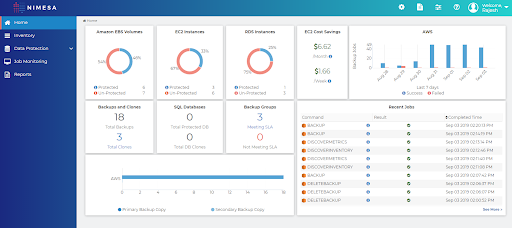
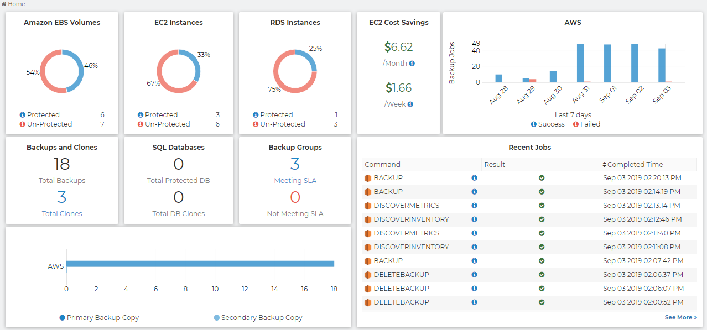

# Home
The home screen will appear when the user login into NIMESA. User can check the status and result of the recent 10 jobs, the number of protected and unprotected EC2 Instances and EBS Volumes,  Backups and Clones created by using Nimesa, SQL/MySQL Databases statistics, Backup Groups which are meeting/not meeting SLA, Primary vs Secondary Backup copies count from the home screen.

                **Home Screen** 
 
**Recent Job** : Details of the jobs like Discover Inventory, backup, Restore etc... and its status can be viewed from this panel.

**Backup Job Status** : Users can see the statistics of the number of successful backup jobs that ran on the day for last 7 days. On clicking the Success/Failed bar in the Backup, the page will be redirected to job monitoring with Success/Failed Backup filters on the selected date.

**EC2 Instance Chart** : User can see the number of protected and unprotected AWS EC2  Instances. Clicking on the Protected/Unprotected pie chart will redirect to the Inventory screen and list all the instances which are Protected/Unprotected in a Region.

**Amazon EBS Volumes** : User can see the number of protected and unprotected AWS EBS  Volumes. Clicking on the Protected/Unprotected pie chart will redirect to the Inventory screen and list all the volumes which are Protected/Unprotected in a Region.