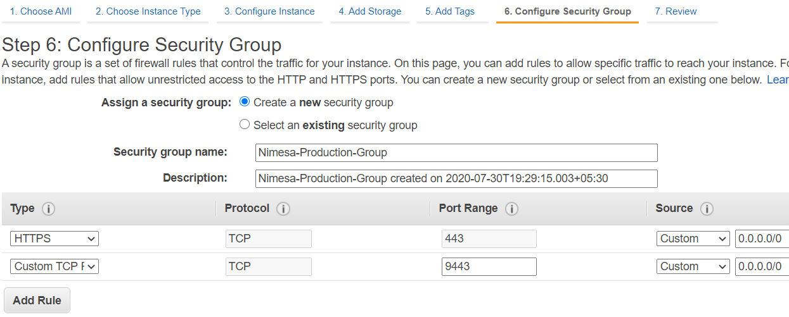

# Deploying Nimesa AMI

For deploying NIMESA, login into AWS console and do the following steps:
- Select EC2 service and Click on Launch Instance button.
- Search for “Nimesa Cloud Data Protection” which will list the Nimesa AMIs available in the Marketplace.
- Select “Nimesa Cloud Data Protection (Version)” and Launch (For e.g Nimesa Cloud Data Protection v1.2.125).
- Instance Type must be t2.small or higher.
- Use default values for other steps and in Configure security group:
  - Select type to HTTPS and source to Custom 0.0.0.0/0.
  - Additionally select Custom TCP port number 9443 with source set to Custom 0.0.0.0/0.
- If Archival Feature is to be used additionally configure the following ports in security group.
  - Select Custom TCP port number 5672 with source set to Custom 0.0.0.0/0.
  - Select Custom TCP port number 3306 with source set to Custom 0.0.0.0/0.
  
  
- Review and Launch.
- You can choose/create a key pair or continue without a key pair to Launch Instance.
- Once the instance is launched and initialized successfully, open https://< IPv4 (Public Ip)> of the instance in a [supported browser](https://docs.google.com/document/d/1130T92jUepAERcuokErJtPqOdiufkVlhnArA8_yPoW8/edit#heading=h.iy5on6421ng4).

## Setup
After launching Nimesa in a [supported browser](https://docs.google.com/document/d/1130T92jUepAERcuokErJtPqOdiufkVlhnArA8_yPoW8/edit#heading=h.iy5on6421ng4) for the first time, the Nimesa Setup page will open prompting for the Nimesa Instance ID. On providing the valid Instance ID of the deployed Nimesa machine, EULA will be displayed. After accepting it, the user signup page will be displayed, where the user will have to provide Full Name, Company Name, Email ID, Username and Password.
  