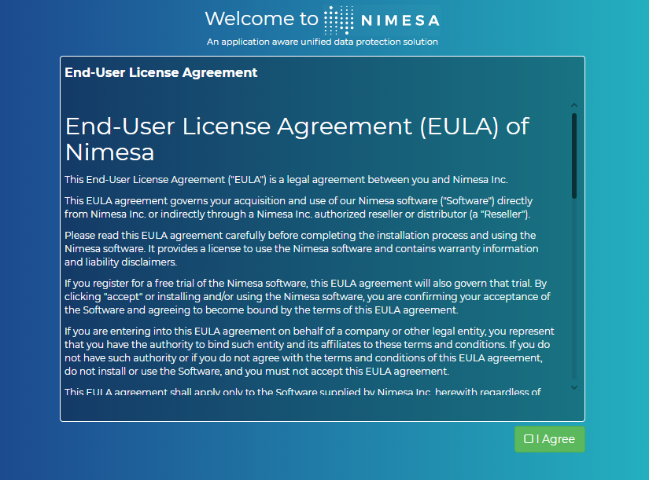
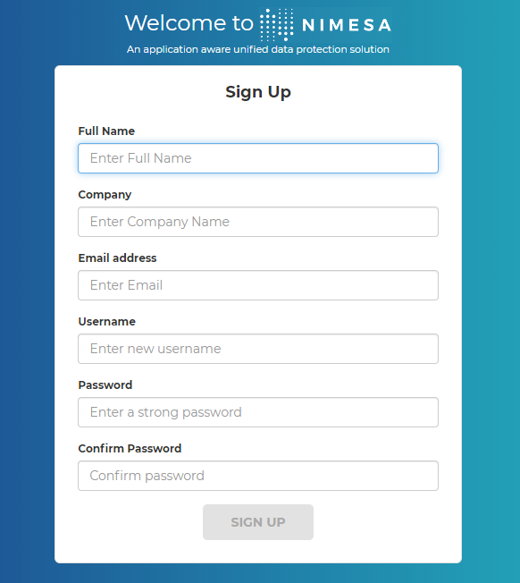
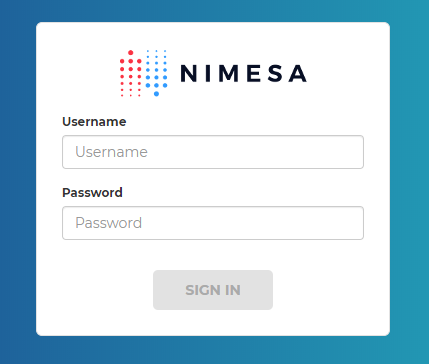

# Signup/Login
Enter the NIMESA IP address (with ‘https’ protocol) you provided during the deployment of the NIMESA  in a [supported browser](https://docs.google.com/document/d/1130T92jUepAERcuokErJtPqOdiufkVlhnArA8_yPoW8/edit#heading=h.iy5on6421ng4). 
As mentioned in the setup section, when a user is opening Nimesa UI for the 1st time, the Signup page will be displayed. Once a user has signed-up, the login page will be displayed where the user will be entering the registered Username and Password.
After validating the credentials, the user will be redirected to the Home screen.

